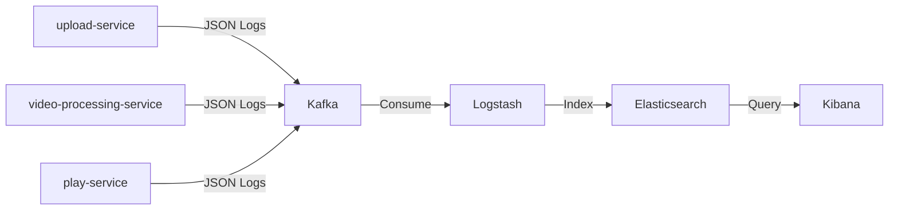

# ELK Stack Integration Plan

## Overview

This plan outlines the integration of the ELK (Elasticsearch, Logstash, Kibana) stack into the streaming platform. The architecture follows a log shipping pattern where:

1. **Each service** writes structured logs to **Kafka** topics
2. **Logstash** consumes logs from Kafka and forwards them to Elasticsearch
3. **Elasticsearch** indexes and stores the logs
4. **Kibana** provides visualization and search capabilities



---

## Components to Add

### 1. Infrastructure (Docker Compose)

#### Kafka (KRaft Mode - No Zookeeper)

Kafka 3.3+ supports **KRaft mode** which uses Kafka's internal Raft consensus for metadata management, eliminating Zookeeper dependency.

```yaml
# Add to infra/local/docker-compose.yml

kafka:
  image: confluentinc/cp-kafka:7.5.0
  container_name: kafka
  ports:
    - "9092:9092"
    - "29092:29092"
  environment:
    # KRaft mode settings
    KAFKA_NODE_ID: 1
    KAFKA_PROCESS_ROLES: broker,controller
    KAFKA_CONTROLLER_QUORUM_VOTERS: 1@kafka:29093
    KAFKA_CONTROLLER_LISTENER_NAMES: CONTROLLER
    
    # Listener configuration
    KAFKA_LISTENERS: PLAINTEXT://kafka:29092,CONTROLLER://kafka:29093,PLAINTEXT_HOST://0.0.0.0:9092
    KAFKA_ADVERTISED_LISTENERS: PLAINTEXT://kafka:29092,PLAINTEXT_HOST://localhost:9092
    KAFKA_LISTENER_SECURITY_PROTOCOL_MAP: CONTROLLER:PLAINTEXT,PLAINTEXT:PLAINTEXT,PLAINTEXT_HOST:PLAINTEXT
    KAFKA_INTER_BROKER_LISTENER_NAME: PLAINTEXT
    
    # Cluster settings
    KAFKA_OFFSETS_TOPIC_REPLICATION_FACTOR: 1
    KAFKA_TRANSACTION_STATE_LOG_REPLICATION_FACTOR: 1
    KAFKA_TRANSACTION_STATE_LOG_MIN_ISR: 1
    KAFKA_AUTO_CREATE_TOPICS_ENABLE: "true"
    
    # Storage
    CLUSTER_ID: 'MkU3OEVBNTcwNTJENDM2Qk'  # Generated with: kafka-storage random-uuid
    KAFKA_LOG_DIRS: /var/lib/kafka/data
  volumes:
    - kafka-data:/var/lib/kafka/data
  networks:
    - streaming-platform-network
  healthcheck:
    test: ["CMD-SHELL", "kafka-topics --bootstrap-server localhost:9092 --list"]
    interval: 10s
    timeout: 5s
    retries: 5
```

#### Elasticsearch

```yaml
elasticsearch:
  image: docker.elastic.co/elasticsearch/elasticsearch:8.11.0
  container_name: elasticsearch
  environment:
    - discovery.type=single-node
    - xpack.security.enabled=false
    - "ES_JAVA_OPTS=-Xms512m -Xmx512m"
  ports:
    - "9200:9200"
    - "9300:9300"
  volumes:
    - elasticsearch-data:/usr/share/elasticsearch/data
  networks:
    - streaming-platform-network
  healthcheck:
    test: ["CMD-SHELL", "curl -s http://localhost:9200/_cluster/health | grep -q 'status']
    interval: 10s
    timeout: 10s
    retries: 5
```

#### Logstash

```yaml
logstash:
  image: docker.elastic.co/logstash/logstash:8.11.0
  container_name: logstash
  volumes:
    - ../logstash/pipeline:/usr/share/logstash/pipeline:ro
  ports:
    - "5044:5044"
  environment:
    - "LS_JAVA_OPTS=-Xmx256m -Xms256m"
  depends_on:
    elasticsearch:
      condition: service_healthy
    kafka:
      condition: service_started
  networks:
    - streaming-platform-network
```

#### Kibana

```yaml
kibana:
  image: docker.elastic.co/kibana/kibana:8.11.0
  container_name: kibana
  ports:
    - "5601:5601"
  environment:
    - ELASTICSEARCH_HOSTS=http://elasticsearch:9200
  depends_on:
    elasticsearch:
      condition: service_healthy
  networks:
    - streaming-platform-network
```

#### Volume Definition

```yaml
volumes:
  elasticsearch-data:
  kafka-data:
```

---

### 2. Logstash Pipeline Configuration

Create file: `infra/logstash/pipeline/logstash.conf`

```conf
input {
  kafka {
    bootstrap_servers => "kafka:29092"
    topics => ["service-logs"]
    group_id => "logstash-consumers"
    codec => json
    decorate_events => "basic"
  }
}

filter {
  # Parse timestamp from the log
  date {
    match => ["timestamp", "ISO8601"]
    target => "@timestamp"
  }
  
  # Add environment tag
  mutate {
    add_field => { "environment" => "local" }
  }
  
  # Parse exception stack traces if present
  if [stack_trace] {
    mutate {
      gsub => ["stack_trace", "\t", "    "]
    }
  }
}

output {
  elasticsearch {
    hosts => ["elasticsearch:9200"]
    index => "service-logs-%{+YYYY.MM.dd}"
  }
  
  # Optional: stdout for debugging
  stdout {
    codec => rubydebug
  }
}
```

---

### 3. Java Dependencies (Common Module)

Add to `common/pom.xml`:

```xml
<!-- Kafka Appender for Logback -->
<dependency>
  <groupId>com.github.danielwegener</groupId>
  <artifactId>logback-kafka-appender</artifactId>
  <version>0.2.0-RC2</version>
</dependency>

<!-- Logstash JSON Encoder -->
<dependency>
  <groupId>net.logstash.logback</groupId>
  <artifactId>logstash-logback-encoder</artifactId>
  <version>7.4</version>
</dependency>

<!-- Kafka Client -->
<dependency>
  <groupId>org.apache.kafka</groupId>
  <artifactId>kafka-clients</artifactId>
</dependency>
```

---

### 4. Logback Configuration

Create shared configuration in `common/src/main/resources/logback-kafka.xml`:

```xml
<?xml version="1.0" encoding="UTF-8"?>
<included>
    <!-- Kafka Appender -->
    <appender name="KAFKA" class="com.github.danielwegener.logback.kafka.KafkaAppender">
        <encoder class="net.logstash.logback.encoder.LogstashEncoder">
            <includeMdcKeyName>traceId</includeMdcKeyName>
            <includeMdcKeyName>spanId</includeMdcKeyName>
            <includeMdcKeyName>userId</includeMdcKeyName>
            <customFields>{"service":"${SERVICE_NAME:-unknown}"}</customFields>
        </encoder>
        
        <topic>service-logs</topic>
        <keyingStrategy class="com.github.danielwegener.logback.kafka.keying.NoKeyKeyingStrategy"/>
        <deliveryStrategy class="com.github.danielwegener.logback.kafka.delivery.AsynchronousDeliveryStrategy"/>
        
        <producerConfig>bootstrap.servers=${KAFKA_BOOTSTRAP_SERVERS:-localhost:9092}</producerConfig>
        <producerConfig>acks=0</producerConfig>
        <producerConfig>linger.ms=100</producerConfig>
        <producerConfig>max.block.ms=1000</producerConfig>
        <producerConfig>client.id=${SERVICE_NAME:-service}-logback</producerConfig>
        
        <!-- Fallback appender if Kafka is unavailable -->
        <appender-ref ref="CONSOLE"/>
    </appender>
    
    <!-- Async wrapper for better performance -->
    <appender name="ASYNC_KAFKA" class="ch.qos.logback.classic.AsyncAppender">
        <appender-ref ref="KAFKA"/>
        <queueSize>512</queueSize>
        <discardingThreshold>0</discardingThreshold>
        <includeCallerData>true</includeCallerData>
    </appender>
</included>
```

---

### 5. Per-Service Logback Configuration

Each service needs its own `logback-spring.xml`. Example for `upload-service`:

Create: `upload-service/src/main/resources/logback-spring.xml`

```xml
<?xml version="1.0" encoding="UTF-8"?>
<configuration>
    <springProperty scope="context" name="SERVICE_NAME" source="spring.application.name" defaultValue="upload-service"/>
    
    <!-- Console Appender for local development -->
    <appender name="CONSOLE" class="ch.qos.logback.core.ConsoleAppender">
        <encoder class="net.logstash.logback.encoder.LogstashEncoder">
            <customFields>{"service":"${SERVICE_NAME}"}</customFields>
        </encoder>
    </appender>
    
    <!-- Include Kafka appender configuration -->
    <include resource="logback-kafka.xml"/>
    
    <!-- Profile: local (logs to console and Kafka) -->
    <springProfile name="local,dev">
        <root level="INFO">
            <appender-ref ref="CONSOLE"/>
            <appender-ref ref="ASYNC_KAFKA"/>
        </root>
    </springProfile>
    
    <!-- Profile: prod (logs only to Kafka) -->
    <springProfile name="prod">
        <root level="INFO">
            <appender-ref ref="ASYNC_KAFKA"/>
        </root>
    </springProfile>
    
    <!-- Default (no profile - console only) -->
    <springProfile name="default">
        <root level="INFO">
            <appender-ref ref="CONSOLE"/>
        </root>
    </springProfile>
    
    <!-- Service-specific logger levels -->
    <logger name="com.b4s1ccoder.upload_service" level="DEBUG"/>
    <logger name="org.apache.kafka" level="WARN"/>
</configuration>
```

---

### 6. Application Configuration Updates

Add Kafka settings to each service's `application.yaml`:

```yaml
# Logging to Kafka
logging:
  kafka:
    bootstrap-servers: ${KAFKA_BOOTSTRAP_SERVERS:localhost:9092}
    topic: service-logs
```

---

### 7. Environment Variables

Add to service env files (`infra/env/*.env`):

```bash
# Kafka Configuration
KAFKA_BOOTSTRAP_SERVERS=kafka:29092

# Optional: Enable/disable Kafka logging
KAFKA_LOGGING_ENABLED=true
```

---

## Implementation Steps

### Phase 1: Infrastructure Setup
1. [ ] Add Kafka (KRaft mode), Elasticsearch, Logstash, and Kibana to `docker-compose.yml`
2. [ ] Create Logstash pipeline configuration in `infra/logstash/pipeline/`
3. [ ] Add volume definitions for Kafka and Elasticsearch data persistence

### Phase 2: Common Logging Module
4. [ ] Add Kafka and Logstash dependencies to `common/pom.xml`
5. [ ] Create shared Logback Kafka configuration in `common/src/main/resources/`

### Phase 3: Service Integration (Detailed Below)
6. [ ] Create `logback-spring.xml` for each service
7. [ ] Update environment variables in env files
8. [ ] Test log output locally before Docker deployment

---

## Service Integration - Detailed Steps

### Step 1: Add Dependencies to Common Module

Update `common/pom.xml` to include logging dependencies that all services will inherit:

```xml
<!-- Add inside <dependencies> -->

<!-- Kafka Appender for Logback -->
<dependency>
  <groupId>com.github.danielwegener</groupId>
  <artifactId>logback-kafka-appender</artifactId>
  <version>0.2.0-RC2</version>
</dependency>

<!-- Logstash JSON Encoder - structured logging -->
<dependency>
  <groupId>net.logstash.logback</groupId>
  <artifactId>logstash-logback-encoder</artifactId>
  <version>7.4</version>
</dependency>

<!-- Kafka Client (managed by Spring Boot) -->
<dependency>
  <groupId>org.apache.kafka</groupId>
  <artifactId>kafka-clients</artifactId>
</dependency>
```

### Step 2: Create Shared Kafka Appender Configuration

Create `common/src/main/resources/logback-kafka.xml`:

This file defines the Kafka appender that all services will include. It:
- Formats logs as JSON using `LogstashEncoder`
- Sends logs asynchronously to Kafka topic `service-logs`
- Falls back to console if Kafka is unavailable

```xml
<?xml version="1.0" encoding="UTF-8"?>
<included>
    <!-- Kafka Appender -->
    <appender name="KAFKA" class="com.github.danielwegener.logback.kafka.KafkaAppender">
        <encoder class="net.logstash.logback.encoder.LogstashEncoder">
            <!-- Include MDC fields for tracing -->
            <includeMdcKeyName>traceId</includeMdcKeyName>
            <includeMdcKeyName>spanId</includeMdcKeyName>
            <includeMdcKeyName>userId</includeMdcKeyName>
            <!-- Service name from environment variable -->
            <customFields>{"service":"${SERVICE_NAME:-unknown}"}</customFields>
        </encoder>
        
        <topic>service-logs</topic>
        <keyingStrategy class="com.github.danielwegener.logback.kafka.keying.NoKeyKeyingStrategy"/>
        <deliveryStrategy class="com.github.danielwegener.logback.kafka.delivery.AsynchronousDeliveryStrategy"/>
        
        <!-- Kafka producer configuration -->
        <producerConfig>bootstrap.servers=${KAFKA_BOOTSTRAP_SERVERS:-localhost:9092}</producerConfig>
        <producerConfig>acks=0</producerConfig>
        <producerConfig>linger.ms=100</producerConfig>
        <producerConfig>max.block.ms=1000</producerConfig>
        <producerConfig>client.id=${SERVICE_NAME:-service}-logback</producerConfig>
        
        <!-- Fallback appender if Kafka is unavailable -->
        <appender-ref ref="CONSOLE"/>
    </appender>
    
    <!-- Async wrapper for non-blocking logging -->
    <appender name="ASYNC_KAFKA" class="ch.qos.logback.classic.AsyncAppender">
        <appender-ref ref="KAFKA"/>
        <queueSize>512</queueSize>
        <discardingThreshold>0</discardingThreshold>
        <includeCallerData>true</includeCallerData>
    </appender>
</included>
```

### Step 3: Create Per-Service Logback Configuration

Each service needs its own `logback-spring.xml` that:
1. Defines the console appender
2. Includes the shared Kafka configuration
3. Sets up Spring profiles for different environments

#### For `upload-service/src/main/resources/logback-spring.xml`:

```xml
<?xml version="1.0" encoding="UTF-8"?>
<configuration>
    <!-- Read service name from Spring config -->
    <springProperty scope="context" name="SERVICE_NAME" 
                    source="spring.application.name" defaultValue="upload-service"/>
    
    <!-- Console Appender with JSON format -->
    <appender name="CONSOLE" class="ch.qos.logback.core.ConsoleAppender">
        <encoder class="net.logstash.logback.encoder.LogstashEncoder">
            <customFields>{"service":"${SERVICE_NAME}"}</customFields>
        </encoder>
    </appender>
    
    <!-- Include shared Kafka appender -->
    <include resource="logback-kafka.xml"/>
    
    <!-- Profile: local/dev - logs to both console and Kafka -->
    <springProfile name="local,dev">
        <root level="INFO">
            <appender-ref ref="CONSOLE"/>
            <appender-ref ref="ASYNC_KAFKA"/>
        </root>
    </springProfile>
    
    <!-- Profile: prod - logs only to Kafka -->
    <springProfile name="prod">
        <root level="INFO">
            <appender-ref ref="ASYNC_KAFKA"/>
        </root>
    </springProfile>
    
    <!-- Default (no profile) - console only -->
    <springProfile name="default">
        <root level="INFO">
            <appender-ref ref="CONSOLE"/>
        </root>
    </springProfile>
    
    <!-- Service-specific logger levels -->
    <logger name="com.b4s1ccoder.upload_service" level="DEBUG"/>
    <logger name="org.apache.kafka" level="WARN"/>
</configuration>
```

#### For `video-processing-service/src/main/resources/logback-spring.xml`:

Same structure, change:
- `defaultValue="video-processing-service"`
- `<logger name="com.b4s1ccoder.video_processing_service" level="DEBUG"/>`

#### For `play-service/src/main/resources/logback-spring.xml`:

Same structure, change:
- `defaultValue="play-service"`
- `<logger name="com.b4s1ccoder.play_service" level="DEBUG"/>`

### Step 4: Update Environment Files

Add Kafka configuration to each service's env file:

#### `infra/env/upload.service.env`:
```bash
# Add these lines
KAFKA_BOOTSTRAP_SERVERS=kafka:29092
SPRING_PROFILES_ACTIVE=local
```

#### `infra/env/video.service.env`:
```bash
KAFKA_BOOTSTRAP_SERVERS=kafka:29092
SPRING_PROFILES_ACTIVE=local
```

#### `infra/env/play.service.env`:
```bash
KAFKA_BOOTSTRAP_SERVERS=kafka:29092
SPRING_PROFILES_ACTIVE=local
```

### Step 5: Update Docker Compose Service Dependencies

Update each service in `docker-compose.yml` to depend on Kafka:

```yaml
sp-upload-service:
  # ... existing config ...
  depends_on:
    - localstack
    - metadata-db
    - kafka  # Add this
```

### Step 6: Add Structured Logging to Code (Optional Enhancement)

To add contextual information to logs, use MDC (Mapped Diagnostic Context):

```java
import org.slf4j.MDC;

// In a request filter or interceptor
public void addLoggingContext(String userId, String traceId) {
    MDC.put("userId", userId);
    MDC.put("traceId", traceId);
}

// Clear after request completes
public void clearLoggingContext() {
    MDC.clear();
}
```

This context will automatically be included in all Kafka log messages.

### Phase 4: Verification
10. [ ] Start the infrastructure with Docker Compose
11. [ ] Verify Kafka is receiving logs
12. [ ] Verify Elasticsearch is indexing logs
13. [ ] Access Kibana and create index pattern for `service-logs-*`

---

## Verification Plan

### Manual Testing Steps

1. **Start the infrastructure:**
   ```bash
   cd infra/local
   docker-compose up -d
   ```

2. **Check Kafka topics:**
   ```bash
   docker exec -it kafka kafka-topics --list --bootstrap-server localhost:9092
   ```
   Expected: `service-logs` topic should be created

3. **Consume from Kafka to verify logs are being produced:**
   ```bash
   docker exec -it kafka kafka-console-consumer --bootstrap-server localhost:9092 --topic service-logs --from-beginning
   ```

4. **Check Elasticsearch indices:**
   ```bash
   curl http://localhost:9200/_cat/indices?v
   ```
   Expected: `service-logs-YYYY.MM.dd` indices

5. **Access Kibana:**
   - Open http://localhost:5601
   - Go to Management → Stack Management → Data Views
   - Create data view with pattern `service-logs-*`
   - Navigate to Discover to view logs

---

## Sample Log Output

Each service will produce JSON logs like:

```json
{
  "@timestamp": "2024-02-03T10:15:30.123Z",
  "@version": "1",
  "message": "Video upload completed successfully",
  "logger_name": "com.b4s1ccoder.upload_service.service.VideoService",
  "thread_name": "http-nio-20001-exec-1",
  "level": "INFO",
  "level_value": 20000,
  "service": "upload-service",
  "traceId": "abc123",
  "stack_trace": null
}
```

---

## Notes

> [!IMPORTANT]
> The Kafka appender includes a fallback to console logging. If Kafka is unavailable, logs will still appear on stdout without blocking the application.

> [!TIP]
> For production, consider:
> - Running Elasticsearch as a cluster (3+ nodes)
> - Using Kafka with replication factor > 1
> - Implementing log retention policies in Elasticsearch (ILM policies)
> - Adding authentication to Kibana and Elasticsearch

> [!NOTE]
> The `logback-kafka-appender` library is configured to be non-blocking with async delivery. This ensures logging doesn't impact application performance even if Kafka has temporary issues.

---

## File Structure After Implementation

```
streaming-platform/
├── infra/
│   ├── local/
│   │   └── docker-compose.yml          # Updated with ELK + Kafka
│   ├── logstash/
│   │   └── pipeline/
│   │       └── logstash.conf           # NEW
│   └── env/
│       ├── upload.service.env          # Updated with KAFKA_BOOTSTRAP_SERVERS
│       ├── play.service.env            # Updated with KAFKA_BOOTSTRAP_SERVERS
│       └── video.service.env           # Updated with KAFKA_BOOTSTRAP_SERVERS
├── common/
│   ├── pom.xml                         # Updated with dependencies
│   └── src/main/resources/
│       └── logback-kafka.xml           # NEW - shared config
├── upload-service/
│   └── src/main/resources/
│       └── logback-spring.xml          # NEW
├── video-processing-service/
│   └── src/main/resources/
│       └── logback-spring.xml          # NEW
└── play-service/
    └── src/main/resources/
        └── logback-spring.xml          # NEW
```
