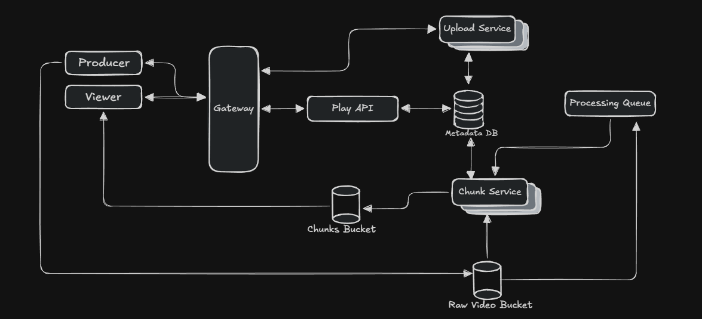
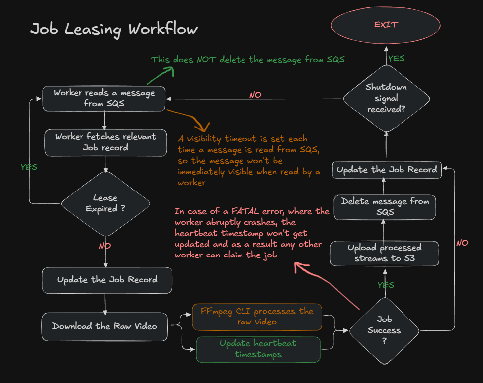
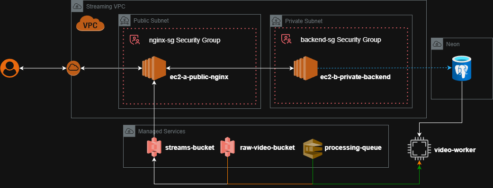

# Streaming Platform
Project to learn about Adaptive Bit Rate Streaming.

<picture>
  <source media="(prefers-color-scheme: dark)" srcset="./SysDesignDark.png">
  <source media="(prefers-color-scheme: light)" srcset="./SysDesignLight.png">
  
</picture>

## Architecture
The goal of this project is to learn about the video processing pipelines used in streaming platforms such as Netflix and Prime Video. The project uses a multi-service architecture:
- `Upload Service`: Used to upload the videos to s3 (multipart upload)
- `Video Processing Service`: Pulls raw video from s3, converts into HLS 1080p, 720p, 480p, 240p for `Adaptive Bitrate Streaming`, also utilizes GPU Acceleration for this process (`Nvidia RTX 3050 4GB Laptop GPU`)
- Play API: Client facing "dumb" API that just gives the available (`.m3u8`) and handles auth, basically the entrypoint.

>**Note**: PlayAPI is work in progress, but the core feature i.e. the video processing pipeline is complete.

## Techstack
Spring Boot 4.0.1, Postgres, AWS S3, AWS SQS (AWS Services provided via Localstack).

## Idempotent Job Processing
Since there can be multiple instances of the `video-processing-service` (aka `chunk-service`), it is important to ensure that video is only **processed once** and by a **single worker** (at any given time). Along with this, we would also want to ensure that in case of a failure, the job is not left hanging (i.e. a situation in which a video is not processed by any worker at all).

Each `video-processing-service` would *"lease"* i.e. temporarily own the job (video to process). It works by updating heartbeat timestamps in the `metadata-db` to assert it's ownership throughout the duration of processing. Whenever a heartbeat timestamp is not updated within an acceptible timeframe, then that job can be claimed by any other instance.

Detailed working below:
<picture>
  <source media="(prefers-color-scheme: dark)" srcset="./ref/JobLeaseDark.png">
  <source media="(prefers-color-scheme: light)" srcset="./ref/JobLeaseLight.png">
  
</picture>

## Deployment

More details in [deploy/README.md](./deploy/README.md).
