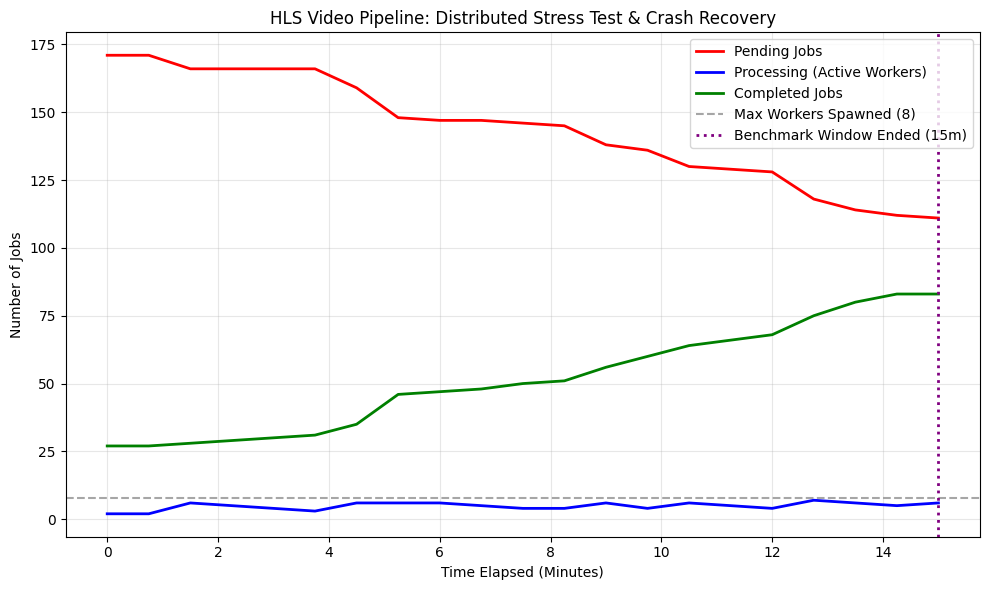

# Benchmark
The following benchmark is run **only for 15 minutes** due to hardware constraints. You are fee to run the benchmark completely to get complete insights.

## Interpreting the graph:
1. *The Grey Dotted Line*: It indicates the number of active workers. For the above graph it is 7.
2. *Blue Line*: It indicate the number of workers that are currently processing a video (downloading raw video and uploading the processed one is **NOT** considered processing). Also in this simulation, each worker has a 10% chance of failure (exits **without graceful shutdown** to simulate catestrophic failure).
3. *Purple Line*: Indicates the observation period (15 mins.), you can set this to a higher value in [web/benchmark.js](./web/benchmark.js) to run the benchmark for longer.
4. *Red Line*: Indicates the pending jobs i.e. jobs in queue. The system was initially flooded with 171 jobs in queue (for the above graph).
5. *Green Line*: Indicates the number of completed jobs.

## Metrics at the End
| Metric | Benchmark Result | Details |
| :--- | :--- | :--- |
| **Average Queue Dwell Time** | 1519.95 seconds | Represents queue saturation and backpressure resilience. |
| **Worker Crash Recoveries** | 20 instances | MTTR tested via Postgres lease expirations and Docker container resurrections. |
| **Duplicate Processing** | 0 jobs | Demonstrated 0% lock contention under chaotic concurrent load. |
| **Total Completed** | 83 / 100 | Processed within a strict 15-minute observation window. |

>**Note**: Before you judge! Please see below

You might think that Average Queue Dwell Time of **1519.95 Seconds** is huge. But do consider the fact that it is under the following constraints:
- 171 Jobs of variable length, hence processing time for each varies greatly
- 7 workers only for ~170 jobs that's ~24.28 Jobs per worker
- a positive is that the `DB Stored Procedures` and `Heartbeat mechanism for job claiming` are working just fine under load.

## Hardware Utilized
- Development Machine
  - Nvida RTX 3050 4GB Laptop GPU; 16 GB RAM (7 GB available to WSL2); Ryzen 7 5000 Series (Windows 11)

- Benchmark Machine
  - Intel Core i5-7200U; 12 GB RAM (6.96 GB used by benchmark); (EndeavourOS x86_64)

>**Note**: Benchmark Machine maybe weaker, but due to some reasons I could not increase the RAM limit in `.wslconfig` and WSL2 kept crashing when I ran the benchmark. Hence, I switched to a native linux machine (my old laptop).

In the end this is just a project made by a student trying to understand how systems like Netflex, Prime Video, HotStar work and process large amounts of raw video data.
